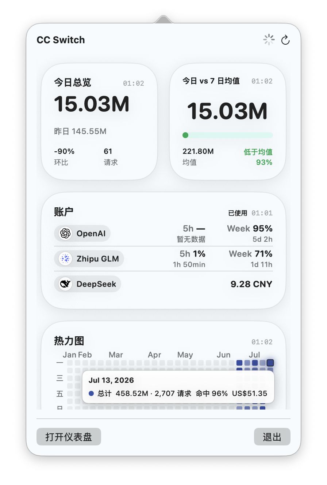

# CC Switch Widgets

> 常驻 macOS 桌面与菜单栏的 AI 用量 / 花费监控组件。直接读取 [CC Switch](https://github.com/farion1231/cc-switch) 的数据，装上就能看——不用自己逐个配置 provider。

[CC Switch](https://github.com/farion1231/cc-switch) 是目前很火的 AI provider 管理工具，我本人也高度依赖使用它。本组件**不替代它管理 provider**，只是给 CC Switch 配了一个能随时瞄一眼用量和花费的桌面组件/菜单展示栏。

## 截图

<p align="center">
  
  
</p>
<p align="center">
  
  
</p>

## 它解决什么

用 Claude Code / Codex / Gemini 写代码，烧了多少 token、花了多少钱，平时基本没数——想看还得一个个去翻设置、对账对到头秃。CC Switch Widgets 把每天的用量和花费算出来摆到桌面上，干活时余光扫一眼心里就有数。

## 特性

- **直接接 CC Switch**：读它的请求日志（**只读、不碰配置、不上传**），不用再每个 provider 自己配一遍监控。只要在 CC Switch 里能配余额查询的（含各种**中转站**），这边就能一起查到。
- **桌面组件 + 菜单栏**：macOS 上最适合「瞄一眼」的两种形态。
  - 桌面组件：今日总览、今日 vs 7 日均值、应用卡、Top 模型、模型排行、用量趋势、费用概览。
  - 菜单栏：常驻硬币图标，实时显示 token / 请求数 / 花费，点开 popover 看趋势明细。
- **用量 + 花费可视化**：当天 / 7 日 / 30 日趋势、模型排行、应用分项、费用（今日 / 昨日 / 本月）。
- **可定制**：深色 / 浅色 / 自定义主题色、涨跌色、刷新频率、图表区间。
- **开源可扩展**：框架搭得干净，想加 provider、改配色、加图表，fork 接着改就行（这组件本身就是 vibe coding 出来的 🤣）。

## 支持的 provider

当前接的是 **Claude Code、Codex、Gemini**（通过 CC Switch 的 provider 配置）。要支持别的工具，自己加即可。

## 工作原理

宿主 App 会以只读模式读取 CC Switch 的
`~/.cc-switch/cc-switch.db`，查询 `proxy_request_logs`，
不会修改 CC Switch 的数据库、配置或应用文件。

macOS Widget 扩展运行在独立沙盒中，不能可靠继承宿主 App
对该数据库目录的访问授权。因此数据流为：

1. 宿主 App 只读查询 CC Switch 数据库并聚合统计；
2. 将聚合后的结果保存到 App Group 的本地 JSON 快照；
3. 桌面组件、菜单栏界面从该快照读取并渲染。

不会向开发者服务器上传用量数据或账号数据。
如启用了余额查询，App 会按你的 CC Switch 配置，
直接请求对应 Provider 的官方/兼容额度接口；OAuth 凭据仅用于该请求，
不会发送给本项目的任何服务器。

## 安装

### 方式一：下载即用（普通用户）

1. 到 [Releases](../../releases) 下载最新的 `.dmg`。
2. 打开 `.dmg`，把 `CCSwitchWidgets.app` 拖进「Applications」文件夹。
3. 首次打开会被 Gatekeeper 拦截（未公证），在终端执行一次：
   ```bash
   xattr -dr com.apple.quarantine /Applications/CCSwitchWidgets.app
   ```
   或右键 → 打开。
4. 启动 App，按提示连接 CC Switch；再到桌面长按 → 编辑组件，搜索「CC Switch」添加。

### 方式二：自己编译（开发者）

需要 **macOS 14+**、**Xcode 15+**、[xcodegen](https://github.com/yonaskolb/XcodeGen)。

```bash
# 克隆本仓库后进入目录；用你自己的 Apple 开发者团队（个人免费团队也可），不设则用项目默认团队
DEVELOPMENT_TEAM=你的TeamID bash script/build_and_run.sh
```

## 使用

打开 App 后可设置：

- 连接 CC Switch 数据目录（默认 `~/.cc-switch`）。
- 主题色 / 涨跌色 / 刷新频率 / 图表区间。
- 立即刷新。

桌面组件在「编辑组件」里选择类型、大小、范围；点击桌面组件可通过 `ccswitchwidgets://chart` 打开 App 的交互式图表。

## 限制

- **需要 macOS 14 及以上**（14 / 15 / 26 都可以；依赖 WidgetKit / Swift Charts），暂无 Windows / Linux 版。
- 需要先安装并配置好 [CC Switch](https://github.com/farion1231/cc-switch)。
- 用量 / 花费依赖 CC Switch 记录的请求日志；未经过 CC Switch 的请求不计入。

## 开发

技术栈：Swift 6 · SwiftUI · WidgetKit · AppIntents · Swift Charts · SQLite3。

```bash
swift test                       # 跑核心逻辑测试
bash script/build_and_run.sh     # 构建并安装到 ~/Applications
bash script/build_release.sh     # 构建并打包 Release .dmg（发布用）
```

欢迎 PR：加 provider 支持、新组件类型、配色、图表……

